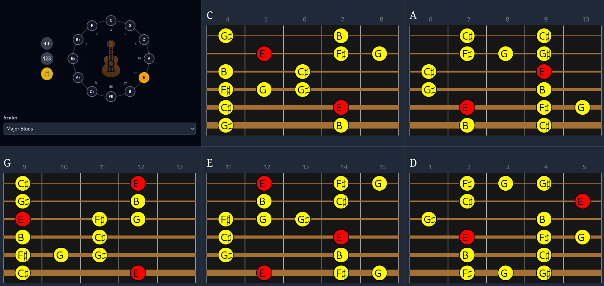

# GuitarCharts

GuitarCharts is a lightweight web application for visualizing guitar scales and chords with an emphasis on clarity, beauty, and ease of use.

- 🌟 Built using Riot and NPM
- 🖊️ SVG-based fingering charts and Circle of Fifths
- 👀 Simple, intuitive interface
- 🔢 Focus on CAGED system and common scale modes

## Features

- Interactive **Circle of Fifths**
- Selectable **scale modes** (Major, Minor, Pentatonic, Blues, etc.)
- View all **CAGED positions** for any scale instantly
- **Root notes** clearly highlighted
- Option to **display intervals** or **note names**
- Designed for **guitarists learning theory and fretboard navigation**

## Current Scale Modes Supported

- Major Scale
- Natural Minor Scale
- Major Pentatonic Scale
- Minor Pentatonic Scale
- Major Blues Scale
- Minor Blues Scale

More to come!

## Getting Started

### Prerequisites
- NPM

## Philosophy

**GuitarCharts** was designed to feel like a musician's tool, not a math textbook. Minimalist, practical, and visually intuitive.

We believe that **understanding the fretboard visually** is the key to mastering guitar theory and improvisation.

## Roadmap

- ✅ 1.0 Release: Basic CAGED scale visualization for key modes
- ⏳ Future Releases:
    - Chord charts (Major, Minor, 7th, Extensions)
    - Custom user scales
    - Advanced scale mode library (e.g., Harmonic Minor, Melodic Minor)
    - Mobile-friendly optimizations
    - Save/share custom charts

## Dev Notes
- All note names internally use Unicode ♯ and ♭ characters. If new platforms are targeted in the future (like legacy mobile browsers), revisit rendering compatibility.

## Contributing

Contributions are welcome! Feel free to fork the repository and submit a pull request.

---

Made with ❤️ for guitar players everywhere.
